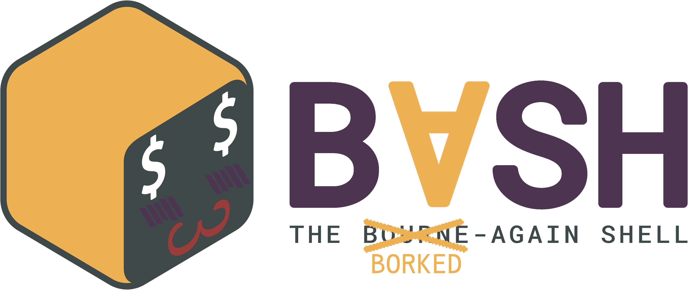

<div align="center">
  
<div>
  
</div>

# bVsh
**the borked-again shell**

*for when regular old Bash just isn't malicious enough...*

[About](#about) •
[Dependencies](#dependencies) •
[Configuration](#configuration) •
[Deployment](#deployment)
[Semantics](#semantics)

</div>

## About
**bVsh** is a fork of bash providing *compile-time* hooks for the deployment and execution of hidden malicious shell code

### Folder Structure
```
bVsh/
├── bash/                 # "hooked" fork of bash 5.2.37
├── bin/                  # binary of bVsh shell
├── hooks/                # scripts built by *you* that get injected into bVsh
│   ├── init.sh           # ran at shell startup, after ~/.bashrc
│   ├── before.sh         # ran before every command that's executed 
│   └── after.sh          # ran after every command that's executed
├── generate_backdoor.sh  # modifies the source code of Bash to include the shell code in hooks/
└── build.sh              # generates the binaries required to deploy bVsh
```

## Dependencies
Given that bVsh is based off of Bash, the only dependencies needed to build bVsh are GCC and GNU Make, if you don't know what those are or how to obtain them then you're likely in the wrong place anyways :P

## Configuration
1. **Modify** each of the shell scripts in `hooks/` to achieve desired behavior
2. **Configure** the source code of Bash to contain the malicious scripts through running `./generate_backdoor.sh`

## Deployment
1. **Compile** bVsh by running `./build.sh`
2. **Copy** the relevent files from `bin/` to `/usr/bin`

## Semantics
- The `init.sh` hook is executed regardless of whether the shell is interactive or not
- The `before.sh` and `after.sh` hooks are only executed in an interactive shell
